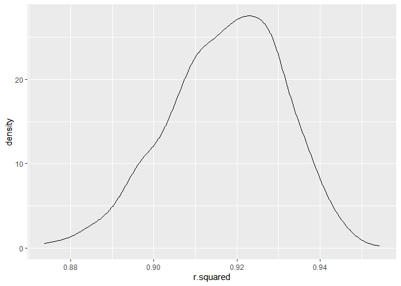
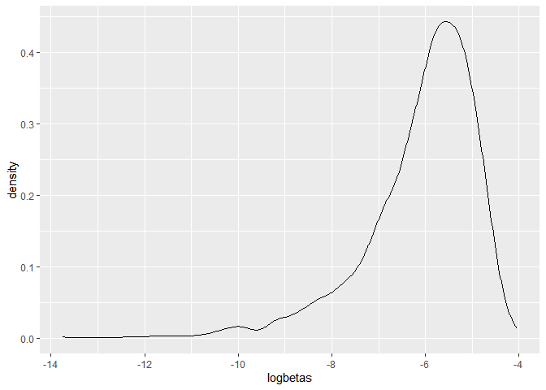

p8105_hw6_msk2265
================
Mirah
2023-12-02

The boostrap is helpful when you’d like to perform inference for a
parameter / value / summary that doesn’t have an easy-to-write-down
distribution in the usual repeated sampling framework. We’ll focus on a
simple linear regression with tmax as the response with tmin and prcp as
the predictors, and are interested in the distribution of two quantities
estimated from these data:

r^2 log(β<sup>1∗β</sup>2)

Use 5000 bootstrap samples and, for each bootstrap sample, produce
estimates of these two quantities.

``` r
boot_sample = function(df) {
  sample_frac(df, replace = TRUE)
}
```

``` r
weather_df %>% 
  modelr::bootstrap(1000)
```

    ## # A tibble: 1,000 × 2
    ##    strap                .id  
    ##    <list>               <chr>
    ##  1 <resample [365 x 6]> 0001 
    ##  2 <resample [365 x 6]> 0002 
    ##  3 <resample [365 x 6]> 0003 
    ##  4 <resample [365 x 6]> 0004 
    ##  5 <resample [365 x 6]> 0005 
    ##  6 <resample [365 x 6]> 0006 
    ##  7 <resample [365 x 6]> 0007 
    ##  8 <resample [365 x 6]> 0008 
    ##  9 <resample [365 x 6]> 0009 
    ## 10 <resample [365 x 6]> 0010 
    ## # ℹ 990 more rows

``` r
#creating bootstrap samples
boot_df = weather_df %>% 
  bootstrap(1000) |> 
  mutate(
    models = map(strap, ~lm(tmax ~ tmin + prcp, data = .)),
    results_tidy = map(models, broom::tidy),
    results_glance = map(models, broom::glance)) |> 
  select(-strap, -models) %>% 
  unnest(results_tidy) %>% 
  unnest(results_glance, names_repair = "minimal") %>% 
  select(-p.value, -statistic, -std.error) %>% 
  pivot_wider(
    names_from = "term",
    values_from = "estimate"
  ) %>% 
  mutate(logbetas=log((prcp*tmin))
  )
```

    ## Warning: There was 1 warning in `mutate()`.
    ## ℹ In argument: `logbetas = log((prcp * tmin))`.
    ## Caused by warning in `log()`:
    ## ! NaNs produced

``` r
#plot distribution
boot_df %>% 
  ggplot(aes(x = r.squared)) +geom_density()
```

<!-- -->

``` r
boot_df %>% 
  ggplot(aes(x = logbetas)) +geom_density()
```

    ## Warning: Removed 679 rows containing non-finite values (`stat_density()`).

<!-- -->

``` r
boot_df %>% 
  summarise(med=median(r.squared),
            lowerqt=quantile(r.squared, 0.025),
            upperqt=quantile(r.squared, 0.975))
```

    ## # A tibble: 1 × 3
    ##     med lowerqt upperqt
    ##   <dbl>   <dbl>   <dbl>
    ## 1 0.917   0.889   0.939

``` r
boot_df %>% 
  summarise(med=median(logbetas, na.rm=TRUE),
            lowerqt=quantile(logbetas, 0.025, na.rm=TRUE),
            upperqt=quantile(logbetas, 0.975, na.rm=TRUE))
```

    ## # A tibble: 1 × 3
    ##     med lowerqt upperqt
    ##   <dbl>   <dbl>   <dbl>
    ## 1 -5.86   -8.68   -4.54

Plot the distribution of your estimates, and describe these in words.
Using the 5000 bootstrap estimates, identify the 2.5% and 97.5%
quantiles to provide a 95% confidence interval for r^2 and
log(β<sup>0∗β</sup>1)

. Note: broom::glance() is helpful for extracting r^2 from a fitted
regression, and broom::tidy() (with some additional wrangling) should
help in computing log(β<sup>1∗β</sup>2) .
