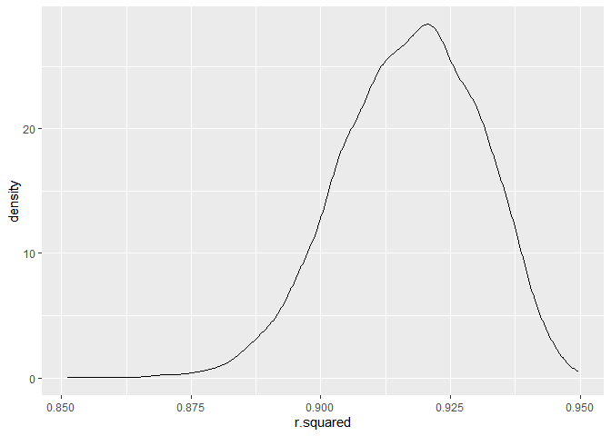
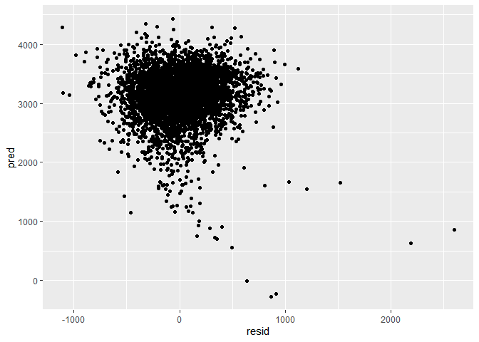

p8105_hw6_msk2265
================
Mirah
2023-12-02

The boostrap is helpful when you’d like to perform inference for a
parameter / value / summary that doesn’t have an easy-to-write-down
distribution in the usual repeated sampling framework. We’ll focus on a
simple linear regression with tmax as the response with tmin and prcp as
the predictors, and are interested in the distribution of two quantities
estimated from these data:

r^2 log(β<sup>1∗β</sup>2)

Use 5000 bootstrap samples and, for each bootstrap sample, produce
estimates of these two quantities.

``` r
boot_sample = function(df) {
  sample_frac(df, replace = TRUE)
}
```

``` r
weather_df %>% 
  modelr::bootstrap(1000)
```

    ## # A tibble: 1,000 × 2
    ##    strap                .id  
    ##    <list>               <chr>
    ##  1 <resample [365 x 6]> 0001 
    ##  2 <resample [365 x 6]> 0002 
    ##  3 <resample [365 x 6]> 0003 
    ##  4 <resample [365 x 6]> 0004 
    ##  5 <resample [365 x 6]> 0005 
    ##  6 <resample [365 x 6]> 0006 
    ##  7 <resample [365 x 6]> 0007 
    ##  8 <resample [365 x 6]> 0008 
    ##  9 <resample [365 x 6]> 0009 
    ## 10 <resample [365 x 6]> 0010 
    ## # ℹ 990 more rows

``` r
#creating bootstrap samples
boot_df = weather_df %>% 
  bootstrap(5000) |> 
  mutate(
    models = map(strap, ~lm(tmax ~ tmin + prcp, data = .)),
    results_tidy = map(models, broom::tidy),
    results_glance = map(models, broom::glance)) |> 
  select(-strap, -models) %>% 
  unnest(results_tidy) %>% 
  unnest(results_glance, names_repair = "minimal") %>% 
  select(-p.value, -statistic, -std.error) %>% 
  pivot_wider(
    names_from = "term",
    values_from = "estimate"
  ) %>% 
  mutate(logbetas=log((prcp*tmin))
  )
```

    ## Warning: There was 1 warning in `mutate()`.
    ## ℹ In argument: `logbetas = log((prcp * tmin))`.
    ## Caused by warning in `log()`:
    ## ! NaNs produced

Plot the distribution of your estimates, and describe these in words.
Using the 5000 bootstrap estimates, identify the 2.5% and 97.5%
quantiles to provide a 95% confidence interval for r^2 and
log(β<sup>0∗β</sup>1)

``` r
#plot distribution
boot_df %>% 
  ggplot(aes(x = r.squared)) +geom_density()
```

<!-- -->

The distribution of r.squared looks to be negatively skewed

``` r
boot_df %>% 
  ggplot(aes(x = logbetas)) +geom_density()
```

    ## Warning: Removed 3376 rows containing non-finite values (`stat_density()`).

<!-- -->
The distribution of logbetas is shows a stronger negative skew than the
r.sqauared distribution

``` r
boot_df %>% 
  summarise(med=median(r.squared),
            lowerqt=quantile(r.squared, 0.025),
            upperqt=quantile(r.squared, 0.975))
```

    ## # A tibble: 1 × 3
    ##     med lowerqt upperqt
    ##   <dbl>   <dbl>   <dbl>
    ## 1 0.918   0.890   0.940

quantiles of r.squared are in the table above

``` r
boot_df %>% 
  summarise(med=median(logbetas, na.rm=TRUE),
            lowerqt=quantile(logbetas, 0.025, na.rm=TRUE),
            upperqt=quantile(logbetas, 0.975, na.rm=TRUE))
```

    ## # A tibble: 1 × 3
    ##     med lowerqt upperqt
    ##   <dbl>   <dbl>   <dbl>
    ## 1 -5.86   -8.93   -4.60

quantiles of logbetas are in the table above.

\##Problem 3

``` r
#tidy data
birth_weight_df = read_csv("./Data/birthweight.csv") %>% 
  mutate(
    babysex = 
      case_match(
        babysex,
        1 ~ "male",
        2 ~ "female"),
    frace =
      case_match(
        frace,
        1 ~ "white",
        2 ~ "black",
        3 ~ "asian",
        4 ~ "puerto rican",
        8 ~ "other"),
    mrace =
      case_match(
        mrace,
        1 ~ "white",
        2 ~ "black",
        3 ~ "asian",
        4 ~ "puerto rican",
        8 ~ "other"),
    malform =
      case_match(
        malform,
        0 ~ "absent",
        1 ~ "present")
      )
```

    ## Rows: 4342 Columns: 20
    ## ── Column specification ────────────────────────────────────────────────────────
    ## Delimiter: ","
    ## dbl (20): babysex, bhead, blength, bwt, delwt, fincome, frace, gaweeks, malf...
    ## 
    ## ℹ Use `spec()` to retrieve the full column specification for this data.
    ## ℹ Specify the column types or set `show_col_types = FALSE` to quiet this message.

Propose a regression model for birthweight. This model may be based on a
hypothesized structure for the factors that underly birthweight, on a
data-driven model-building process, or a combination of the two.
Describe your modeling process and show a plot of model residuals
against fitted values – use add_predictions and add_residuals in making
this plot.

The fist thing I evaluated when making my model, was several
scatterplots to visualize the relationship between bwt and other numeric
variables. The plots are below:

``` r
#model1
#making plots to see if I can see relationships:

birth_weight_df %>% ggplot(aes(x=bhead, y=bwt))+geom_point()
```

<!-- -->

``` r
#shows kinda linear
birth_weight_df %>% ggplot(aes(x=blength, y=bwt))+geom_point()
```

<!-- -->

``` r
#shows kinda linear
birth_weight_df %>% ggplot(aes(x=delwt, y=bwt))+geom_point()
```

<!-- -->

``` r
birth_weight_df %>% ggplot(aes(x=fincome, y=bwt))+geom_point()
```

<!-- -->

``` r
birth_weight_df %>% ggplot(aes(x=gaweeks, y=bwt))+geom_point()
```

<!-- -->

``` r
#shows kinda linear
birth_weight_df %>% ggplot(aes(x=menarche, y=bwt))+geom_point()
```

<!-- -->

``` r
birth_weight_df %>% ggplot(aes(x=mheight, y=bwt))+geom_point()
```

<!-- -->

``` r
birth_weight_df %>% ggplot(aes(x=momage, y=bwt))+geom_point()
```

<!-- -->

``` r
birth_weight_df %>% ggplot(aes(x=ppbmi, y=bwt))+geom_point()
```

<!-- -->

``` r
birth_weight_df %>% ggplot(aes(x=ppwt, y=bwt))+geom_point()
```

<!-- -->

``` r
birth_weight_df %>% ggplot(aes(x=smoken, y=bwt))+geom_point()
```

<!-- -->

``` r
birth_weight_df %>% ggplot(aes(x=wtgain, y=bwt))+geom_point()
```

<!-- -->

Second, I compared the categorical variables by calculating averages.

``` r
birth_weight_df %>% 
  group_by(babysex) %>% 
  summarise(avwt=mean(bwt)) %>% 
  ungroup()
```

    ## # A tibble: 2 × 2
    ##   babysex  avwt
    ##   <chr>   <dbl>
    ## 1 female  3069.
    ## 2 male    3158.

``` r
#not that different

birth_weight_df %>% 
  group_by(frace) %>% 
  summarise(avwt=mean(bwt)) %>% 
  ungroup()
```

    ## # A tibble: 5 × 2
    ##   frace         avwt
    ##   <chr>        <dbl>
    ## 1 asian        3160.
    ## 2 black        2952.
    ## 3 other        3177 
    ## 4 puerto rican 3062.
    ## 5 white        3266.

``` r
#not that different
birth_weight_df %>% 
  group_by(mrace) %>% 
  summarise(avwt=mean(bwt)) %>% 
  ungroup()
```

    ## # A tibble: 4 × 2
    ##   mrace         avwt
    ##   <chr>        <dbl>
    ## 1 asian        3140.
    ## 2 black        2950.
    ## 3 puerto rican 3055.
    ## 4 white        3267.

``` r
#not that diffeent
birth_weight_df %>% 
  group_by(malform) %>% 
  summarise(avwt=mean(bwt)) %>% 
  ungroup()
```

    ## # A tibble: 2 × 2
    ##   malform  avwt
    ##   <chr>   <dbl>
    ## 1 absent  3114.
    ## 2 present 3126

``` r
#not that different
```

Based on all of those results, and the results of my scatter plots, I
came up with the model below. I would like to note that hypothesis tests
would have been a good idea for the categorical variables above to
detwemine if there averages are statistically significantly different or
not, and I would do that in a full report. I would also probably
calculate correlation coefficiants for the scatterplots.

``` r
model1 = lm(bwt ~ bhead + gaweeks + blength, data = birth_weight_df)
summary(model1)
```

    ## 
    ## Call:
    ## lm(formula = bwt ~ bhead + gaweeks + blength, data = birth_weight_df)
    ## 
    ## Residuals:
    ##      Min       1Q   Median       3Q      Max 
    ## -1105.73  -191.84   -10.99   178.74  2596.80 
    ## 
    ## Coefficients:
    ##              Estimate Std. Error t value Pr(>|t|)    
    ## (Intercept) -6195.572     96.352 -64.301   <2e-16 ***
    ## bhead         138.853      3.531  39.325   <2e-16 ***
    ## gaweeks        14.601      1.509   9.677   <2e-16 ***
    ## blength        81.643      2.084  39.177   <2e-16 ***
    ## ---
    ## Signif. codes:  0 '***' 0.001 '**' 0.01 '*' 0.05 '.' 0.1 ' ' 1
    ## 
    ## Residual standard error: 286.1 on 4338 degrees of freedom
    ## Multiple R-squared:  0.6881, Adjusted R-squared:  0.6879 
    ## F-statistic:  3190 on 3 and 4338 DF,  p-value: < 2.2e-16

``` r
#plot residuals against fitted values

birth_weight_df %>% 
  add_residuals(model1) %>% 
  add_predictions(model1) %>% 
  ggplot(aes(x=resid, y=pred)) +geom_point()
```

<!-- -->
All three of the predictors I chose are significant, based on the p
values. The residuals versus fitted values plot indicates equal variance
because the points hover around 0 for the resid, with some outliers that
have a high resid. Compare your model to two others:

One using length at birth and gestational age as predictors (main
effects only)

``` r
model2 = lm(bwt ~ blength + gaweeks, data = birth_weight_df)
summary(model2)
```

    ## 
    ## Call:
    ## lm(formula = bwt ~ blength + gaweeks, data = birth_weight_df)
    ## 
    ## Residuals:
    ##     Min      1Q  Median      3Q     Max 
    ## -1709.6  -215.4   -11.4   208.2  4188.8 
    ## 
    ## Coefficients:
    ##              Estimate Std. Error t value Pr(>|t|)    
    ## (Intercept) -4347.667     97.958  -44.38   <2e-16 ***
    ## blength       128.556      1.990   64.60   <2e-16 ***
    ## gaweeks        27.047      1.718   15.74   <2e-16 ***
    ## ---
    ## Signif. codes:  0 '***' 0.001 '**' 0.01 '*' 0.05 '.' 0.1 ' ' 1
    ## 
    ## Residual standard error: 333.2 on 4339 degrees of freedom
    ## Multiple R-squared:  0.5769, Adjusted R-squared:  0.5767 
    ## F-statistic:  2958 on 2 and 4339 DF,  p-value: < 2.2e-16

One using head circumference, length, sex, and all interactions
(including the three-way interaction) between these

``` r
model3 = lm(bwt ~ bhead + blength + babysex +bhead*blength +bhead*babysex +blength*babysex + bhead*blength*babysex , data = birth_weight_df)
summary(model3)
```

    ## 
    ## Call:
    ## lm(formula = bwt ~ bhead + blength + babysex + bhead * blength + 
    ##     bhead * babysex + blength * babysex + bhead * blength * babysex, 
    ##     data = birth_weight_df)
    ## 
    ## Residuals:
    ##      Min       1Q   Median       3Q      Max 
    ## -1132.99  -190.42   -10.33   178.63  2617.96 
    ## 
    ## Coefficients:
    ##                             Estimate Std. Error t value Pr(>|t|)    
    ## (Intercept)                -801.9487  1102.3077  -0.728 0.466948    
    ## bhead                       -16.5975    34.0916  -0.487 0.626388    
    ## blength                     -21.6460    23.3720  -0.926 0.354421    
    ## babysexmale               -6374.8684  1677.7669  -3.800 0.000147 ***
    ## bhead:blength                 3.3244     0.7126   4.666 3.17e-06 ***
    ## bhead:babysexmale           198.3932    51.0917   3.883 0.000105 ***
    ## blength:babysexmale         123.7729    35.1185   3.524 0.000429 ***
    ## bhead:blength:babysexmale    -3.8781     1.0566  -3.670 0.000245 ***
    ## ---
    ## Signif. codes:  0 '***' 0.001 '**' 0.01 '*' 0.05 '.' 0.1 ' ' 1
    ## 
    ## Residual standard error: 287.7 on 4334 degrees of freedom
    ## Multiple R-squared:  0.6849, Adjusted R-squared:  0.6844 
    ## F-statistic:  1346 on 7 and 4334 DF,  p-value: < 2.2e-16

Make this comparison in terms of the cross-validated prediction error;
use crossv_mc and functions in purrr as appropriate.

``` r
cv_df = crossv_mc(birth_weight_df, 100)
cv_df |> pull(train) |> nth(1) |> as_tibble()
```

    ## # A tibble: 3,473 × 20
    ##    babysex bhead blength   bwt delwt fincome frace gaweeks malform menarche
    ##    <chr>   <dbl>   <dbl> <dbl> <dbl>   <dbl> <chr>   <dbl> <chr>      <dbl>
    ##  1 female     34      51  3629   177      35 white    39.9 absent        13
    ##  2 male       34      48  3062   156      65 black    25.9 absent        14
    ##  3 female     36      50  3345   148      85 white    39.9 absent        12
    ##  4 male       34      52  3062   157      55 white    40   absent        14
    ##  5 female     34      52  3374   156       5 white    41.6 absent        13
    ##  6 male       33      52  3374   129      55 white    40.7 absent        12
    ##  7 female     33      46  2523   126      96 black    40.3 absent        14
    ##  8 female     33      49  2778   140       5 white    37.4 absent        12
    ##  9 male       36      52  3515   146      85 white    40.3 absent        11
    ## 10 male       33      50  3459   169      75 black    40.7 absent        12
    ## # ℹ 3,463 more rows
    ## # ℹ 10 more variables: mheight <dbl>, momage <dbl>, mrace <chr>, parity <dbl>,
    ## #   pnumlbw <dbl>, pnumsga <dbl>, ppbmi <dbl>, ppwt <dbl>, smoken <dbl>,
    ## #   wtgain <dbl>

``` r
cv_df |> pull(test) |> nth(1) |> as_tibble()
```

    ## # A tibble: 869 × 20
    ##    babysex bhead blength   bwt delwt fincome frace gaweeks malform menarche
    ##    <chr>   <dbl>   <dbl> <dbl> <dbl>   <dbl> <chr>   <dbl> <chr>      <dbl>
    ##  1 female     35      50  3175   140      85 black    40.6 absent        14
    ##  2 female     35      52  3289   135      55 white    40.6 absent        13
    ##  3 female     34      49  3118   161      45 black    38.9 absent        10
    ##  4 female     35      51  3827   130      45 white    41.3 absent        12
    ##  5 female     34      49  2948   135      75 white    42.7 absent        12
    ##  6 male       35      51  3147   165      65 white    40.1 absent        13
    ##  7 female     35      52  3487   121      45 white    39.9 absent        11
    ##  8 male       34      51  3459   123      45 white    40   absent        12
    ##  9 male       34      47  3090   147      85 white    42.1 absent        12
    ## 10 female     34      46  2977   145      75 black    47.7 absent        11
    ## # ℹ 859 more rows
    ## # ℹ 10 more variables: mheight <dbl>, momage <dbl>, mrace <chr>, parity <dbl>,
    ## #   pnumlbw <dbl>, pnumsga <dbl>, ppbmi <dbl>, ppwt <dbl>, smoken <dbl>,
    ## #   wtgain <dbl>

``` r
cv_df =
 
   cv_df |> 
  mutate(
    train = map(train, as_tibble),
    test = map(test, as_tibble))
cv_df = 
  cv_df |> 
  mutate(
    model1_tst  = map(train, ~model1),
    model2_tst  = map(train, ~model2),
    model3_tst  = map(train, ~model3))|> 
  mutate(
    rmse_model1 = map2_dbl(model1_tst, test, \(mod, df) rmse(model = mod, data = df)),
    rmse_model2 = map2_dbl(model2_tst, test, \(mod, df) rmse(model = mod, data = df)),
    rmse_model3 = map2_dbl(model3_tst, test, \(mod, df) rmse(model = mod, data = df)))

cv_df |> 
  select(starts_with("rmse")) |> 
  pivot_longer(
    everything(),
    names_to = "model", 
    values_to = "rmse",
    names_prefix = "rmse_") |> 
  mutate(model = fct_inorder(model)) |> 
  ggplot(aes(x = model, y = rmse)) + geom_violin()
```

<!-- -->

Based on the violin graph, I can see that my model, and the 3rd model
are the best fit, since the rmse is smallest.
